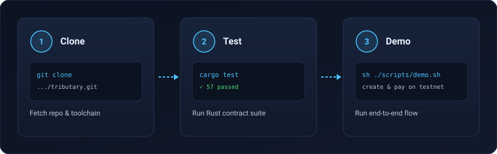

# Contributing to Tributary

Thanks for taking the time. This page covers how to get a working setup and what we expect from changes.

[](assets/clone-test-demo.svg)

## Setup

1. Install Rust from https://rustup.rs. The repo has a `rust-toolchain.toml`, so rustup will pick the right toolchain and targets on first build.
2. Clone the repo and run the tests:

```
git clone https://github.com/tributary-protocol/tributary.git
cd tributary
cargo test
```

3. To build the contract wasm:

```
cargo build --release --target wasm32v1-none -p tributary-splitter
```

## Before opening a pull request

Run these locally. CI runs the same checks and will fail otherwise:

```
cargo fmt --all
cargo clippy --all-targets -- -D warnings
cargo test
```

## What a good change looks like

- One concern per pull request. Small and reviewable beats big and impressive.
- New behavior comes with tests. Bug fixes come with a test that fails without the fix.
- Contract code stays `no_std` and avoids panics in favor of typed errors.
- Comments only where the code cannot explain itself.

## Useful scripts

`scripts/deploy.sh` builds and deploys the contract to testnet. `scripts/demo.sh` runs a full create-and-pay cycle against the deployed contract, which is the quickest way to confirm your environment works end to end. Both need the [Stellar CLI](https://developers.stellar.org/docs/tools/cli) and a funded testnet identity.

## Working on an issue

If you want to work on an existing issue, comment on it first so we do not end up with duplicate work. If you found a bug or want to propose something new, open an issue before writing a large patch.

## License

By contributing, you agree that your contributions are licensed under the Apache-2.0 license that covers this project.
