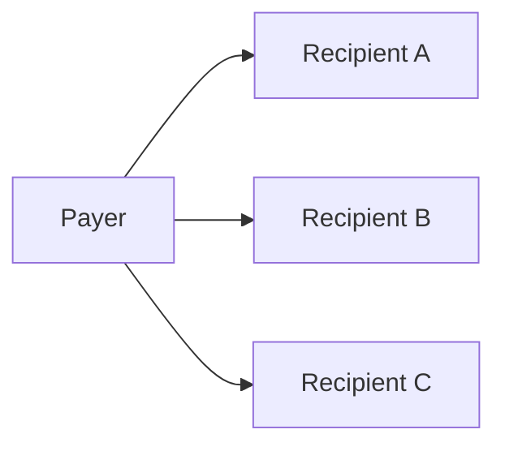
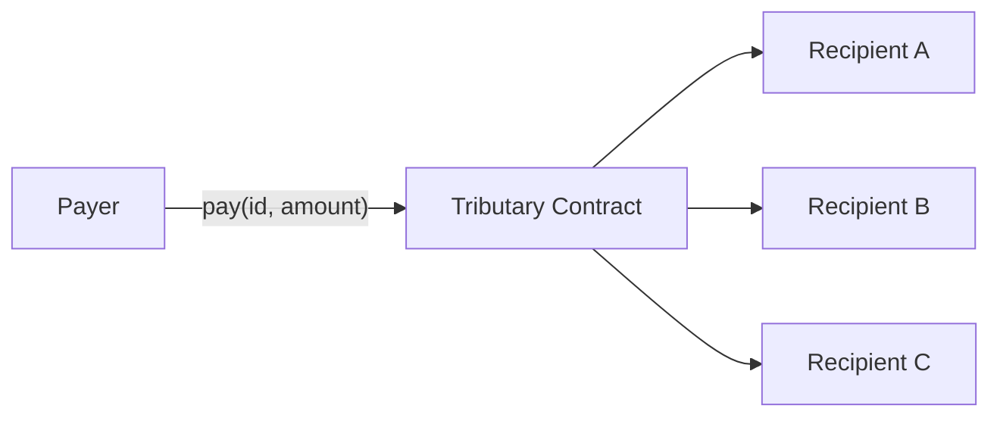

# Splits vs manual multi-send

When you need to pay several parties, the obvious approach is to send each one a
transfer yourself: `pay A`, then `pay B`, then `pay C`. Tributary offers a
different primitive: register a split once, then route a single payment through
it and let the contract fan the money out. This page explains why the atomic
split is usually the better tool, and where the manual approach still makes
sense.

## What "manual multi-send" means

Manual multi-send is exactly what it sounds like: you, the payer, originate N
separate transfers. Each one is its own operation, each one needs its own
authorization, and each one settles on its own:

You decide the amounts, you send them in some order, and the ledger records N
independent movements of money.

## What a split does instead

A split stores the routing table on-chain: a list of recipients and the basis
points each one gets, summing to exactly 10,000. You register it once with
`create_split`, then a single `pay` call moves the whole amount from you to every
recipient inside one transaction:

`pay_many` extends this to several splits at once, still in one transaction and
one signature.

## Why atomic splits win

### All-or-nothing settlement

The biggest difference is failure semantics. Manual multi-send is a sequence of
independent transfers. If the third one fails — a bad address, a broken
trustline, an allowance that lapsed — the first two have already moved. You are
left with a half-paid state and no clean way to reason about who got paid.

A split pays everyone inside a single transaction. The payout for every
recipient runs as one atomic operation: either the whole split settles or none
of it does. There is no in-between state where A and B are paid but C is not.
For anything that is supposed to look like one logical payment — a payroll run, a
marketplace payout, a revenue share — atomicity is exactly the guarantee you
want.

### One signature, one transaction

Manual multi-send asks the payer to authorize N transfers. An atomic split is
one `pay` call, one authorization, one transaction. That is less wallet friction
for the person signing, and it is one network round-trip instead of N. With
`pay_many` you can fan out across several splits in that same single transaction.

### The split is reusable and composable

The routing table lives on-chain. Once a split exists, *anyone* can push a
payment through it — the split owner does not need to be present, and they do not
need to recompute the percentages each time. The same split can be reused for
every payout, so the "who gets what" decision is made once and then trusted
forever (or editable by a controller, if you set one).

Splits also compose: a recipient can be another split. A "project" split can
feed "team" and "treasury" splits, which feed their own recipients, all settled
by a single `pay`. Doing the equivalent by hand means carefully re-deriving and
re-sending every nested amount on every payment — error-prone, and easy to get
out of sync with the intended routing.

### Exact, verifiable amounts

The contract computes each recipient's cut from fixed basis points and rounds
the dust to the last recipient, so the amount in always equals the amount out.
You can preview the exact per-recipient amounts with `preview_payout` before
sending anything — no arithmetic on your side, no drift between what you intended
and what landed. With manual multi-send, you are responsible for getting the
amounts to add up, every single time.

### The routing is inspectable

Because the split is stored, anyone can read it with `get_split` and confirm
exactly where their money will go before they pay. A manual multi-send is just a
sequence of transfers with no on-chain record tying them together as "the same
payment". For a marketplace or a DAO payout, being able to point at one split id
and say "this is the rule" is a real accountability win.

## Where manual multi-send still fits

A split is not free to create, and its routing is fixed (or controller-managed).
Manual multi-send is the better choice when:

- **You pay a one-off, ad-hoc set of parties** and will never repeat the exact
  routing. The fixed cost of registering a split is not worth it for a single,
  throwaway payment.
- **Recipients and amounts vary every time** in ways that do not map to a stable
  basis-point table. If you need fine-grained, per-payment control over exact
  amounts, sending directly is simpler.
- **You must guarantee an independent outcome per party** — for example, you
  want recipient A paid even if recipient B's transfer will definitely fail, and
  you would rather A be settled than nothing at all. Atomicity is a feature of
  splits; it is also a constraint.

## Quick comparison

| Aspect | Manual multi-send | Atomic split (`pay` / `pay_many`) |
| --- | --- | --- |
| Failure behavior | Partial: earlier transfers may already have settled | All-or-nothing per split |
| Authorizations | N signatures / N transactions | One signature / one transaction |
| Reuse | Recomputed every time | Registered once, reused by anyone |
| Composability | Must re-derive nested amounts by hand | Native: splits can route to other splits |
| Amount accuracy | Your responsibility to add up | Contract-computed, `preview_payout` to verify |
| Routing visibility | Scattered transfers | One readable split id |
| Best for | One-off, fully ad-hoc payments | Repeated, shared, composable payouts |

## Bottom line

Manual multi-send lets you hand-stitch payments together at the cost of partial
failures, repeated signing, and no shared routing. A split turns a recurring,
multi-party payment into a single atomic, reusable, inspectable rule. Reach for a
split whenever the *routing* (who gets what share) is stable and worth trusting;
keep manual sends for the genuinely one-off cases.
